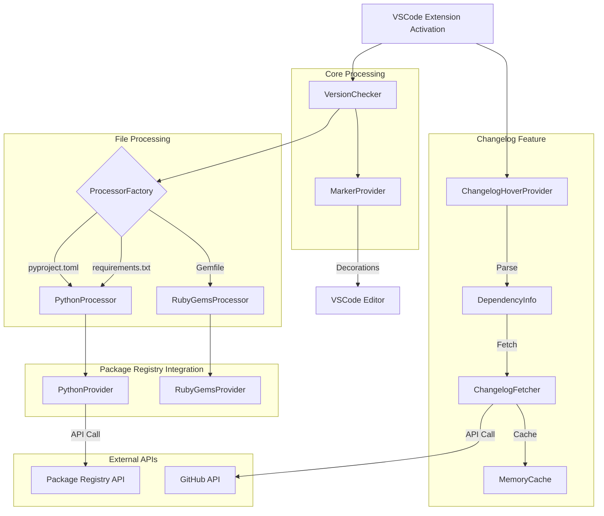

# Contributing to Riched Version Lens

Thank you for your interest in contributing to Riched Version Lens! This document provides guidelines and instructions for contributing to the project.

## Development Setup

1. **Prerequisites**
   - Node.js 20.10.0 or higher
   - Visual Studio Code
   - Git

2. **Setup Steps**
   ```bash
   # Clone the repository
   git clone https://github.com/kiwamizamurai/riched-version-lens.git
   cd riched-version-lens

   # Install dependencies
   npm install

   # Start development mode
   npm run watch
   ```

3. **Running the Extension**
   - Press `F5` in VS Code to start debugging
   - A new VS Code window will open with the extension loaded
   - Make changes and reload (`Ctrl+R` or `Cmd+R`) to see them

## Project Structure

The project follows a modular architecture:

```shell
riched-version-lens/
├── src/
│ ├── core/ # Core extension functionality
│ ├── processors/ # File type specific processors
│ ├── providers/ # Package registry API integrations
│ │ └── changelogHoverProvider.ts # Changelog hover functionality
│ └── utils/
│   └── changelogFetcher.ts # Changelog fetching and caching
├── example/ # Example dependency files for testing
└── test/ # Test files
```

## Architecture

The Riched Version Lens extension follows a modular architecture:



### Processing Flow

1. **Extension Activation**: 
   - Creates `VersionChecker` instance and registers CodeLensProvider
   - Registers `ChangelogHoverProvider` for supported file types
2. **File Processing**: 
   - `ProcessorFactory` generates appropriate processors for each file type
   - `ChangelogHoverProvider` parses dependency information from files
3. **Version Checking**: 
   - Processors use registry providers to fetch latest version information
   - `ChangelogFetcher` retrieves changelogs from package registries or GitHub releases
4. **UI Updates**: 
   - `MarkerProvider` manages editor decorations (✅/🆙)
   - `ChangelogHoverProvider` displays changelogs in hover tooltips

## Development Guidelines

### Code Style

- We use Biome for formatting and linting
- Run before committing:
  ```bash
  npm run format  # Format code
  npm run lint    # Check for issues
  ```

### Testing

1. **Writing Tests**
   - Place tests in `src/test/suite/`
   - Follow existing test patterns (see `pythonProvider.test.ts` and `npmProvider.test.ts`)
   - Use the `TestHelper` for mocking API calls

2. **Running Tests**
   ```bash
   npm run test
   ```

### Adding Support for New Package Managers

1. Create new files:
   - `src/providers/[manager]Provider.ts` - API integration
   - `src/processors/[manager]Processor.ts` - File processing logic
   - `src/test/suite/[manager]Provider.test.ts` - Tests

2. Update Version Checking:
   - Add file type to `src/types/fileTypes.ts`
   - Register processor in `ProcessorFactory`
   - Add file pattern in `extension.ts`

3. Implement Changelog Support:
   - Add parser in `changelogHoverProvider.ts`:
     ```typescript
     private parse[Manager]File(line: vscode.TextLine): { packageName: string; version: string } | null {
         // Implement parsing logic for the new package manager's file format
     }
     ```
   - Update `getDependencyInfo` method to handle the new file type
   - Add changelog fetching logic in `changelogFetcher.ts`:
     ```typescript
     async function fetch[Manager]Changelog(packageName: string, version: string): Promise<string | null> {
         // Implement changelog fetching from the package manager's registry
     }
     ```

4. Add Tests:
   - Add test cases for the new parser in `changelogHoverProvider.test.ts`
   - Add test cases for changelog fetching in `changelogFetcher.test.ts`
   - Add mock responses in `testHelper.ts`:
     ```typescript
     static mock[Manager]Response(packageName: string, version: string) {
         // Add mock responses for the new package manager's API
     }
     ```

5. Update Documentation:
   - Add supported file type in README.md
   - Update architecture diagram if needed
   - Document the new package manager's changelog format
